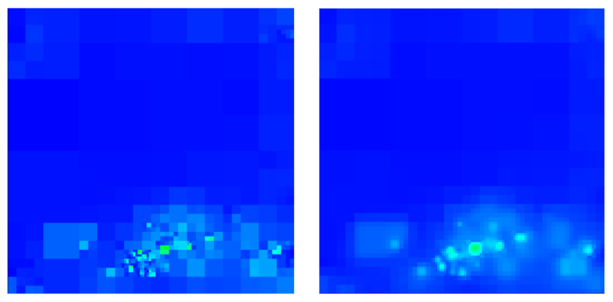

## Guiding Cache Reconstruction for Path Guiding

  

This repository contains the implementation of my master's thesis work titled "Hierarchical Reconstruction of Quadtree-Based Approximations of Incident Radiance". It is based on ["Variance-Aware Path Guiding" [Rath et al. 2020]](https://graphics.cg.uni-saarland.de/publications/rath-2020-siggraph-guiding.html) and ["Practical Path Guiding for Efficient Light-Transport Simulation" [Müller et al. 2017]](https://tom94.net).

## Added Parameters

In addition to the parameters of the [original implementation](https://github.com/Tom94/practical-path-guiding) and [other related work](https://github.com/iRath96/variance-aware-path-guiding) I have added some new parameters that can be found below. These can be set in in the scene XML files by using their property name (denoted by the `monospace text` in brackets).

### Denoising (`denoising`)
This parameter determines whether or not the guiding distributions will be denoised between training iterations.

* `true`: Enables denoising.
* `false`: Disables denoising.

Default = `false`\
Recommended = `true`

### Sigma (`dTreeSigma`)
The standard deviation of the Gaussian filter used for the matrix convolutions when denoising.

Default = `0.8`\
Recommended = `0.3-1.0`, this depends on the scene.

### Workload Limiting (`recWL`)
Whether or not to use *workload limiting* to keep the overhead of reconstruction down.

* `true`: Enables workload limiting.
* `false`: Disables workload limiting.

Default = `true`\
Recommended = `true`

### Guiding Distribution (`distribution`)
The guiding distribution that should be approximated.

* `radiance`: Guiding distribution used by [Müller et al.](https://github.com/Tom94/practical-path-guiding).
* `simple`: Guiding distribution proposed by [Rath et al.](https://github.com/iRath96/variance-aware-path-guiding).
* `full`: Guiding distribution proposed by [Rath et al.](https://github.com/iRath96/variance-aware-path-guiding).
* `switch`: An experimental approach that mixes the `simple` and `full` distributions depending on the state of the training process. My evaluation shows that this approach is quite beneficial both for short and long renders.

## Compilation

### Mitsuba

To compile the Mitsuba code, please follow the instructions from the [Mitsuba documentation](http://mitsuba-renderer.org/docs.html) (sections 4.1.1 through 4.6). Since this new code uses C++11 features, a slightly more recent compiler and dependencies than reported in the mitsuba documentation may be required. I only support compiling mitsuba with the [scons](https://www.scons.org) build system. I only tested the Mitsuba code on Linux Mint 20.2, using GCC 9.4.0.

### Visualization Tool

The visualization tool, found in the *visualizer* subfolder, uses the [CMake](https://cmake.org/) build system. Simply invoke the CMake generator on the *visualizer* subfolder to generate Visual Studio project files on Windows, and a Makefile on Linux / OS X. I only tested the visualizer code on Linux Mint 20.2, using GCC 9.4.0.

## License

The new code introduced by this project is licensed under the GNU General Public License (Version 3). Please consult the bundled LICENSE file for the full license text.

The bundled KITCHEN scene is governed by the [CC-BY 3.0 license](https://creativecommons.org/licenses/by/3.0/).
